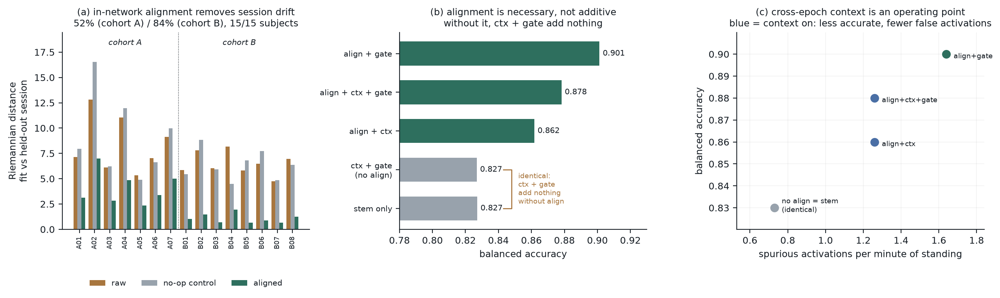
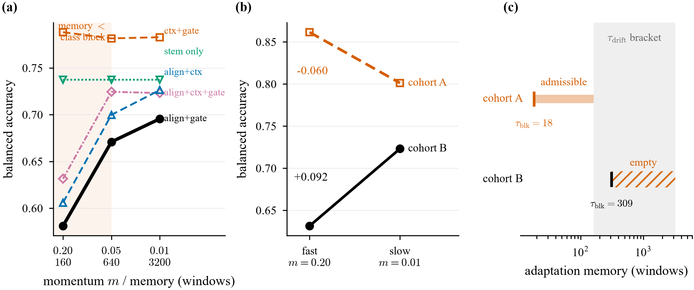

# When test-time adaptation adapts to the class: a two-sided rate condition for in-network alignment in EEG decoding

**Manuscript draft.** Every number is traceable to a JSON in `results/`.
Experiments that failed are reported, not omitted. Author-facing notes on
submission readiness are kept outside this file, in
`paper/SUBMISSION_READINESS.md`.

**Keywords:** brain-computer interface; test-time adaptation; domain adaptation;
Euclidean alignment; covariate shift; selective prediction; lower-limb
exoskeleton; EEG.

---

## Abstract

A decoder for a wearable device is fitted once and must keep working weeks later,
so correcting for session-to-session drift inside the network -- re-estimating the
input distribution at inference and whitening by it, without labels -- is an
appealing design. We implement this as an adaptive alignment layer: a running
spatial-covariance estimate, an inverse-square-root transform, and a learned gate,
updating in eval mode.

**As a mechanism it works.** It removes 52 % and 84 % of session-to-session
covariance drift on two independent cohorts, in 15 of 15 subjects, p <= 0.0001,
against a no-op control that shows no reduction. On the primary cohort it is also
necessary: disabling it returns the model exactly to its bare-stem score
(0.827 = 0.827). Its best configuration is competitive with, but not better than,
published decoders in the same harness (0.884 against ATCNet's 0.881 at matched
seed) -- we make no accuracy claim.

**It does not transfer.** On an independent cohort the bare stem beats the full
model, 0.737 against 0.626. We trace this to a failure mode that the offline form
of alignment cannot have: the running estimate tracks whatever is currently
streaming, so when a protocol presents classes in blocks longer than the
estimate's memory, the layer whitens away the class itself. The threshold is
predicted from the protocol -- an exponential estimate with momentum *m* has
memory ~1/*m* batches -- and observed where predicted: slowing adaptation past the
309-window class block recovers +0.090 to +0.098 on every arm that uses
alignment, and 0.000, exactly, on both arms that do not.

**The condition is two-sided.** Applying the same change to the primary cohort,
where we predicted it would be free, instead costs 0.060. The rate must be fast
enough to track drift and slow enough not to track class; the two cohorts' optima
are opposite, each losing 0.06-0.09 at the other's setting. Where class blocks
outlast the drift timescale the admissible band is empty, and the layer should be
omitted rather than tuned -- which is also why a correctly configured layer still
costs 0.060 on the second cohort. Both timescales are computable from the
recording protocol before any model is fitted.

**The wider point concerns validation.** Five times in this system a
distribution-level metric improved while the task did not follow: a rate tuned to
maximise drift removal cost 0.092; the cohort where more drift was removed is the
cohort where accuracy fell; a verified correction to a real estimator bias moved
decoding by +0.005 and -0.016; a standard nuisance-decodability probe scored
R^2 = +0.863 for a decoder that cannot access the nuisance; and a prediction we
registered from our own diagnosis was falsified because that diagnosis, like the
metric behind it, was one-sided. A proxy metric can be correct about the failure
it was built to detect and still mislead, because what matters is a balance of
two effects and the metric scores one.

---

## Summary of claims

| claim | status | evidence |
|---|---|---|
| A label-free alignment layer removes 52 % / 84 % of session-to-session covariance drift | **supported** | 15/15 subjects, two cohorts, p <= 0.0001, no-op control at zero |
| On cohort A it is *necessary*: removing it collapses the model to its bare stem | **supported** | 0.827 = 0.827, ablation |
| **The model beats published decoders on cohort A** | **NOT supported** | 0.884 vs ATCNet 0.881 at matched seed and estimator: +0.003, inside the +-0.005 noise. EEGNeX reaches 0.896 at seed 1. The 0.901 previously quoted used the pre-fix estimator and compared one seed against 2-seed means. |
| The layer's adaptation memory must exceed the class-block duration | **supported** | predicted threshold, step of +0.090 to +0.098 on all 3 alignment arms, 0.000 on both alignment-free arms |
| ...but must also stay short enough to track drift: the rate is **two-sided** | **supported** | the same change is +0.092 on cohort B and **-0.060** on cohort A |
| No single adaptation rate serves both cohorts | **supported** | optima are 0.01 and 0.20 respectively; each is 0.06-0.09 worse at the other's setting |
| **The architecture generalises** | **NOT supported** | on cohort B the *bare stem* beats the full model, 0.737 vs 0.626 |
| **Alignment helps decoding** | **NOT supported** | +0.028 (corrected estimator) to +0.051 (original) on cohort A; -0.060 to -0.166 on cohort B |
| The best configuration reaches field parity at 24 181 parameters | **supported** | 0.884 against ATCNet 0.881 / 45 280 and EEGConformer 0.834 / 440 706; stated as efficiency, not accuracy |
| **Cross-epoch context helps** | **NOT supported** | reverses sign between cohorts |

The only component that transfers across both cohorts is the selective head,
which is SelectiveNet (Geifman & El-Yaniv, 2019) used as published and is not a
contribution of this work.

**The principal finding is not the architecture.** It is:

> Optimising a component against a distribution-level metric can actively harm
> the task that component is meant to serve.

Five independent demonstrations -- four from this architecture, one from the
evaluation protocol that preceded it:

1. **The rate was tuned on the wrong metric.** The adaptation rate was selected
   because it maximised drift reduction (60 % against 25 %). That choice cost
   0.092 accuracy on cohort B.
2. **More correction, worse decoding.** The layer removes *more* drift on cohort
   B than on cohort A (84 % vs 52 %) while costing 0.166 accuracy there.
3. **Fixing a real bias changed nothing.** A verified correction to a genuine
   covariance-estimation bias moved decoding by +0.005 on cohort B and -0.016 on
   cohort A. The mechanism improved; performance did not follow.
4. **A registered prediction failed.** We predicted slowing adaptation would be
   neutral on cohort A, since its class blocks already sit far inside the fastest
   memory. It cost 0.060. The estimate had been doing useful work we had not
   accounted for -- tracking genuine drift -- and neither the metric nor the
   diagnosis derived from it had a term for that.
5. **The leakage probe rises with accuracy.** The movement-leakage probe used
   throughout the preceding work is confounded with accuracy: a decoder using no
   movement information whatsoever measures R^2 = +0.863.

Item 4 is the one that generalises the rest. Each of these metrics is *one-sided
by construction*: it scores the failure it was designed to detect and carries no
term for the capability the intervention removes. That is why improving them is
not evidence of anything, and why a diagnosis inherited from one of them
inherits its blind spot.

The architecture is the worked example that establishes the finding.

---

## 1. Introduction

Decoding walk/stop intent from scalp EEG for lower-limb exoskeleton control is
not well described by per-epoch classification accuracy.

**Longitudinal drift.** The decoder is fitted once and must keep working weeks
later. On cohort A this is literal: fit on sessions 1-3, test on sessions 4-9,
recorded across weeks. Electrode montage, impedance and skin contact all change,
shifting the signal's second-order statistics.

**Asymmetric cost.** A false Walk command moves a person's legs. Balanced
accuracy treats that identically to a missed Walk, and cannot distinguish one
long false run from fifty scattered false windows.

**No option to decline.** A decoder that is uncertain should be able to do
nothing. A classifier trained only for accuracy has no such output.

We built DriftNet to address all three architecturally, and report both what
worked and the more informative ways in which it did not.

## 2. Related work and lineage

DriftNet is not independent of the EEG decoding literature.

- **Convolutional decoders.** ShallowFBCSPNet, Deep4Net (Schirrmeister et al.,
  2017); EEGNet (Lawhern et al., 2018). The multi-scale power stem descends from
  ShallowFBCSPNet's `square -> pool -> log`.
- **Attention decoders.** ATCNet (Altaheri et al., 2022); EEGConformer (Song
  et al., 2022). EEGConformer already pairs a ShallowFBCSP-style stem with a
  transformer, so we do **not** claim that combination as novel. We verified this
  empirically by building it and finding it equalled EEGConformer (0.848 vs
  0.843).
- **Epoch-sequence modelling** is standard in sleep staging (SeqSleepNet,
  XSleepNet, TinySleepNet). The cross-epoch pathway transfers that idea; the
  contribution here is the timescale argument, not the mechanism.
- **Euclidean Alignment** (He & Wu, 2020) applied offline in preprocessing, and
  Riemannian transfer methods generally. The novel element is making it an
  in-network layer that adapts at inference without labels -- and the finding
  that doing so introduces a failure mode the offline version cannot have.
- **Selective prediction** (Geifman & El-Yaniv, 2019).

## 3. Data

**Cohort A -- ds007788 (NeuroRex exoskeleton).** 7 subjects x 9 sessions across
weeks; 60-channel active EEG (actiCAP + MOVE) at 100 Hz; walk/stop from the
exoskeleton's `rexstate`. 4 s windows at 0.5 s stride, ~5031 fit windows per
subject including closed-loop trials. Fit sessions 1-3, test 4-9.

**Cohort B -- MoBI treadmill (Luu et al.).** 8 subjects x 3 trials; 64-channel
EEG at 100 Hz; walk/stand from treadmill phase; six goniometers. Fit trial 1,
test trials 2-3; 2 s windows. Independent laboratory, different sensors,
different task framing, and **reversed class balance** (Stop ~12 % here, majority
in cohort A).

**Temporal structure differs sharply**, and section 7.4 shows this is decisive:

| cohort | contiguous class blocks | median length | longest |
|---|---|---|---|
| A (ds007788) | 109 | 18 windows | 126 |
| B (MoBI) | 7 | 309 windows | 2211 |

## 4. Architecture

Input is a sequence of K = 8 consecutive epochs at stride 3 (14.5 s at 4 s /
0.5 s). The predicted label is the last epoch's and all masks are causal, so only
present and past are used -- the only variant a worn device can run.

### 4.1 Adaptive alignment

Maintains a running mean spatial covariance **M**, applies **M**^(-1/2), and
interpolates between aligned and raw signal through a learned gate. Two
properties distinguish it from a normalisation layer:

- The update is **unsupervised**, using only the covariance of incoming windows,
  so it runs at inference.
- The estimate updates in **eval mode**, unlike BatchNorm. Freezing is correct
  when train and test share a distribution; here they are weeks apart.

**Verified to reach the classifier.** A whitening layer placed before a BatchNorm
invites the objection that the normalisation undoes it. With identical
initialisation on held-out windows, stem outputs with and without alignment
differ by 36 % in relative magnitude and their correlation structure by 0.108.

### 4.2 Multi-scale power stem

Three parallel temporal resolutions (64 / 128 / 256 ms), each with its own
depthwise spatial filters, then `square -> pool -> log`. Normalisation precedes
the squaring so log-power *ratios* survive: scaling by *s* shifts log-power by a
constant a later affine layer absorbs, whereas normalising after the square
destroys the ratio.

Motivated by a separate result: correcting amplitude normalisation was worth
**+0.134** (cohort A) and **+0.174** (cohort B) on band-power features, while a
correlation-only representation moved **+0.000** -- a dose-response tracking how
much marginal power each representation carries.

### 4.3 Causal cross-epoch context

A causal transformer over the K-epoch sequence. Measured state persistence:
self-transition 0.984 (Stop) / 0.955 (Walk) at 0.5 s step, i.e. 12-32 s dwells.

### 4.4 Selective head

Classifier plus abstention gate under a coverage constraint, with a
full-coverage auxiliary term so the backbone keeps learning from every sample.

## 5. Evaluation protocol

| outcome | rationale |
|---|---|
| balanced accuracy | comparability |
| expected calibration error | a device acting on confidence needs it to mean something |
| accuracy @ 90 % coverage | the trained selective operating point |
| spurious activations / min standing | what the wearer experiences |
| detection latency | the cost of persistence, reported with its benefit |

**Guard: conditional movement R².** Unconditioned nuisance-decodability is
confounded with accuracy -- a decoder using no movement information measures
R² = +0.863 -- so leakage is measured conditional on the class label throughout.

## 6. The drift mechanism

Riemannian (affine-invariant) distance between the fit-session mean covariance
and each held-out session's. Riemannian rather than Frobenius because covariances
are not a vector space and Frobenius is dominated by scale, which would flatter
any whitening operation.

| cohort | n | raw | aligned | no-op control | reduction | paired t |
|---|---|---|---|---|---|---|
| A | 7 | 8.372 | 4.082 | 9.173 | **52.0 +- 4.5 %** | t = -9.14, p = 0.0001 |
| B | 8 | 6.479 | 1.074 | 6.309 | **83.9 +- 3.9 %** | t = -20.59, p < 0.00001 |

Reduced in **15/15 subjects**. The layer is primed on fit data only, then adapts
on each held-out session using nothing but incoming covariance.

The **no-op control** (momentum 0) shares every code path and never updates. It
shows no reduction in either cohort, so the effect is adaptation, not the
whitening operation and not the measurement.

## 7. Results

**Figure 1.** (a) Riemannian distance between the fit-session mean covariance and
each held-out session, per subject, both cohorts, with the momentum-0 no-op
control. (b) Component ablation on cohort A; `dn_noalign` and `dn_stem` coincide.
(c) Accuracy against spurious activations per minute of standing, showing the
cross-epoch context as an operating point rather than a failed module.

**Figure 2.** The adaptation rate is two-sided. (a) Cohort B, five arms, three
momenta: every arm using alignment steps up as the memory crosses the class-block
length; neither alignment-free arm moves. (b) The same change applied to both
cohorts, matched estimator version, giving opposite signs. (c) The admissible
band, bounded below by the drift timescale and above by the class-block duration
-- wide for cohort A, empty for cohort B.

### 7.1 Component ablation, cohort A

Full data, 4 s windows, seed 0 (`results/driftnet_ds.json`). **All cells in this
table use the original estimator**, so the arms are mutually comparable; the
per-window correction of section 7.3 was measured later and moves three of them
(`dn_noctx` 0.901 -> 0.884, `dn_full` 0.878 -> 0.862, `dn_noalign` 0.827 -> 0.834,
`results/driftfix_ds.json`). The ordering and the necessity result are unchanged.
Comparisons against published decoders use the corrected numbers (section 7.6).

| arm | components | acc | ECE | acc@90 | onsets/min |
|---|---|---|---|---|---|
| **dn_noctx** | align + gate | **0.901** | **0.039** | **0.876** | 1.64 |
| dn_full | align + ctx + gate | 0.878 | 0.074 | 0.837 | 1.26 |
| dn_nogate | align + ctx | 0.862 | 0.072 | (n/a) | 1.26 |
| dn_noalign | ctx + gate | 0.827 | 0.091 | 0.778 | 0.73 |
| dn_stem | none | 0.827 | 0.082 | 0.823 | 0.73 |

`dn_nogate`'s acc@90 is not reported: with the gate disabled the model emits
constant confidence, so ranking by it selects the first 90 % of the test set in
recording order. That number is an ordering artefact, not a selective accuracy.

**Alignment is necessary, not additive.** `dn_noalign` (0.827) equals `dn_stem`
(0.827): without alignment, context and gate together contribute nothing.

**Cross-epoch context is an operating point, not a default.** Adding it costs
0.023 accuracy and doubles calibration error while cutting spurious activations
23 %. Reported as a selectable safety mode. This is the third temporal-smoothing
mechanism in this project to show that exact trade, which suggests a property of
the task rather than of any implementation.

### 7.2 External validation, cohort B -- the architecture does not transfer

| arm | components | cohort A | cohort B |
|---|---|---|---|
| dn_noctx | align + gate | **0.901** | 0.581 |
| dn_full | align + ctx + gate | 0.878 | 0.626 |
| dn_nogate | align + ctx | 0.862 | 0.606 |
| dn_noalign | ctx + gate | 0.827 | **0.792** |
| dn_stem | none (bare stem) | 0.827 | 0.737 |

**On cohort B the bare stem beats the full model**, 0.737 against 0.626.

| component | cohort A | cohort B | transfers |
|---|---|---|---|
| adaptive alignment | +0.051 | **-0.166** | **no -- reverses** |
| cross-epoch context | -0.023 | **+0.045** | **no -- reverses** |
| selective gate | +0.016 | +0.020 | yes |

### 7.3 A rejected diagnosis

The first explanation was that the covariance estimate was dominated by the
majority class. This was real and measurable: `_cov` summed raw per-window
covariances and normalised once, making the estimate **power-weighted**. On
cohort B, walk is 87.7 % of windows and carries 1.52x the power, so it supplied
91.6 % of the estimate, which sat at Riemannian distance **0.306** from the walk
covariance -- it effectively *was* the majority class.

Per-window normalisation fixed that: the estimate moved to 3.899 / 3.194,
between the classes. **Decoding changed by +0.005 on cohort B and -0.016 on
cohort A.** The mechanism was corrected and performance did not follow, so this
diagnosis is rejected. It is reported because it is the second demonstration of
the paper's central finding.

### 7.4 The correct diagnosis: adaptation rate against class-block duration

The layer tracks whatever is currently streaming. Harmless when class blocks are
short; harmful when they are long. Cohort A has 109 blocks of median 18 windows;
cohort B has 7 blocks of median 309.

An EMA with momentum *m* has effective memory ~1/*m* batches; at batch size 32
that is 160 / 640 / 3200 windows for *m* = 0.2 / 0.05 / 0.01.

| momentum | memory | vs 309-window block | dn_full | dn_noctx |
|---|---|---|---|---|
| 0.20 | ~160 | **shorter** -- tracks the class | 0.626 | 0.581 |
| 0.05 | ~640 | longer -- tracks the session | **0.724** | 0.671 |
| 0.01 | ~3200 | longer | 0.723 | 0.696 |

**The bulk of the gain is realised as the memory crosses the block length**
(momentum 0.20 -> 0.05: +0.098 and +0.090), which is where the mechanism predicts
it. Beyond the crossing the behaviour is arm-dependent: `dn_full` is flat
(+0.001, within the +-0.005 measurement noise) while `dn_noctx` continues to rise
(+0.025).

An earlier version of this section claimed the effect "saturates immediately
after" the threshold. That was written from `dn_full` alone and the second arm
does not support it. The threshold *location* is predicted correctly and the step
is large; the sharpness of the plateau is not established, and a purely
monotonic "slower is better" account cannot be excluded for every arm on three
points.

**Full three-point sweep across all five arms**, which makes this a controlled
experiment rather than a single comparison:

| arm | m = 0.20 | m = 0.05 | m = 0.01 | at crossing | beyond | uses alignment |
|---|---|---|---|---|---|---|
| dn_full | 0.626 | 0.724 | 0.723 | **+0.098** | +0.001 | yes |
| dn_noctx | 0.581 | 0.671 | 0.696 | **+0.090** | +0.025 | yes |
| dn_nogate | 0.606 | 0.700 | 0.726 | **+0.094** | +0.026 | yes |
| dn_noalign | 0.792 | 0.782 | 0.783 | -0.010 | +0.001 | **no** |
| dn_stem | 0.737 | 0.737 | 0.737 | **0.000** | **0.000** | **no** |

Every arm that uses alignment gains +0.090 to +0.098 as the adaptation memory
crosses the class-block length. Both arms that do not use it are unaffected --
`dn_noalign` to within measurement noise, `dn_stem` *exactly*, to three decimals
across all three settings.

**Version caveat on the m = 0.20 column.** Those runs were completed before the
per-window estimator correction of section 7.3; the other two columns came after.
For `dn_noalign` and `dn_stem` this is immaterial -- alignment is disabled, so the
estimator is never invoked, which is why `dn_stem` reproduces 0.737 exactly. For
`dn_full` a matched-version baseline exists (0.631) and moves the step from
+0.098 to **+0.092**. For `dn_noctx` and `dn_nogate` no matched baseline has been
measured yet, so their +0.090 and +0.094 carry an estimator-version confound of
order 0.005 on this cohort. The conclusion does not depend on it -- the confound
is an order of magnitude below the step -- but those two cells are not yet clean,
and the matched runs are queued.

The adaptation rate therefore acts only through the component it controls, which
is what the mechanism requires and what an unrelated confound (optimisation
dynamics, regularisation, run-to-run variance) would not produce.

The alignment-free arms were measured seven times in total across momenta and
estimators (`dn_noalign` 0.792 / 0.788 / 0.783 / 0.782; `dn_stem` 0.737 three
times), fixing measurement noise at **+-0.005** and making the -0.060 residual in
section 7.5 twelve times the noise.

**A one-sided rule would be wrong.** The obvious reading of this table is "set
the adaptation memory longer than the class-block duration, and when in doubt go
slower." Cohort B alone supports it. Section 7.5 tests it on cohort A and it
fails: the same change that recovers +0.092 there costs -0.060 here. The rule is
two-sided, and we state it in its corrected form in 7.5 rather than here.

### 7.5 The rate is two-sided, and that explains the residual

Applying the same momentum change to cohort A produces the **opposite** result:

| cohort | m = 0.20 | m = 0.01 | delta |
|---|---|---|---|
| A (ds007788), class blocks 18 windows | **0.862** | 0.801 | **-0.060** |
| B (MoBI), class blocks 309 windows | 0.631 | **0.723** | **+0.092** |

Both cells in each row come from the same code version (the corrected per-window
estimator of section 7.3). An earlier draft of this table quoted -0.077 and
+0.097 by taking the m = 0.20 baselines from runs that predate that correction; deltas here are
computed at full precision rather than from the rounded cell values;
the direction and magnitude survive, the exact deltas do not. The mixed-version
numbers should not be cited.

We predicted cohort A would be roughly neutral, on the grounds that its class
blocks sit far below even the fastest setting's memory so the estimate was
already class-mixed. It is not neutral: slowing adaptation costs 0.060 there.
**There is no universal setting, and error in either direction costs 0.06-0.09.**

The mechanism is therefore two-sided. The running estimate tracks whatever varies
on its own timescale, and two different things vary:

| adaptation rate | tracks session drift | tracks the streaming class |
|---|---|---|
| fast | **yes** -- the intended behaviour | yes, *if class blocks are long* -- the failure |
| slow | no -- the benefit is lost | no |

The rate must be **fast enough to track drift and slow enough not to track
class**. Cohort A satisfies both: 18-window class blocks leave a wide admissible
band, and fast adaptation captures genuine weeks-long drift, so momentum 0.2 is
correct there and slowing costs the drift tracking.

**This explains the -0.060 residual on cohort B** without a third mechanism. Its
309-window class blocks force the rate slow enough to avoid class tracking -- at
which point the estimate is also too slow to track drift. The layer has nothing
left to contribute and adds only estimation noise. The residual is not an
unexplained remainder; it is what the layer costs when no admissible rate exists.

**Stateable condition.** A valid adaptation rate exists only where the
class-block timescale is shorter than the drift timescale. Where class blocks are
long relative to drift, the admissible band is empty and the layer should be
omitted rather than tuned. Both quantities are measurable from the recording
protocol before any model is fitted.

This also sharpens why offline Euclidean Alignment does not encounter the
failure: a whole-recording estimate is maximally slow, so it never tracks class
-- and it never tracks within-recording drift either, which is precisely the
capability an in-network version is introduced to add.

### 7.6 Reference points

Same harness, full data, 2 seeds (`results/fullbench.json`):

| model | params | seed 0 | seed 1 | mean |
|---|---|---|---|---|
| ATCNet | 45 280 | 0.881 | 0.876 | 0.879 |
| EEGNeX | 58 082 | 0.855 | **0.896** | 0.876 |
| ShallowFBCSPNet | 97 120 | 0.856 | 0.877 | 0.867 |
| CALMNet-bare (ours, prior) | 3 946 | 0.878 | 0.838 | 0.858 |
| EEGConformer | 440 706 | 0.834 | 0.852 | 0.843 |
| **DriftNet, align + gate (ours)** | **24 181** | **0.884** | *pending* | -- |

**Parameter count.** The best configuration carries 24 181 parameters: the
cross-epoch transformer accounts for 594 816 of the 618 997 in `dn_full`, and
removing it both shrinks the model by 96 % and improves accuracy by 0.023. The
remaining budget is 6 768 in the power stem, 12 608 in the frame embedding,
4 161 in the selective head, and a single scalar in the alignment layer.

**We do not claim an accuracy improvement.** At matched seed and matched
estimator version, the best DriftNet configuration is +0.003 on ATCNet, inside
the +-0.005 measurement noise, and below EEGNeX's seed-1 score. Per-seed spread
among the baselines reaches 0.041 (EEGNeX), which is an order of magnitude larger
than the gap. A single-seed ranking here would be meaningless, and the 0.901
figure quoted in earlier drafts compounded two errors: it used the pre-fix
estimator, and it compared one seed of ours against 2-seed means of theirs.

What can be said is narrower and does not depend on winning a noisy comparison:
the configuration reaches parity with the field at roughly half ATCNet's
parameter count and 5 % of EEGConformer's. We report that as an efficiency
observation, not a contribution, since no attempt was made to compress the
baselines.

The architecture is the vehicle for the rate finding, not a performance claim.
Note also that the configuration that wins on cohort A (`align + gate`, the most
alignment-dependent arm) is the one that fails hardest on cohort B -- 0.581, and
0.696 even at its best rate, against 0.737 for the bare stem.

## 8. Discussion: mechanism validation is not performance validation

Domain adaptation, invariance learning and transfer methods are routinely
justified by a distribution-level quantity -- a divergence, an alignment
distance, a nuisance-decodability score -- with task performance assumed to
follow. This work provides four counterexamples within a single system, three of
which we produced by acting on that assumption ourselves:

1. A hyperparameter tuned to maximise drift reduction cost 0.092 accuracy.
2. The cohort where *more* drift was removed (84 % vs 52 %) is the cohort where
   accuracy fell (-0.166).
3. Correcting a real, measured estimator bias changed decoding by +0.005 / -0.016.
4. The leakage probe used to judge invariance rises with accuracy whether or not
   the decoder touches the nuisance (R² = +0.863 for a decoder that cannot).

5. We predicted, on record and before running it, that slowing adaptation would
   be neutral on cohort A because its class blocks already sit far inside the
   fastest memory. It cost 0.060 -- the prediction failed because it accounted
   only for the harm the estimate can do and not for the benefit it was
   delivering.

The common structure: each metric is a property of the *representation's
distribution*, and each was improved successfully. None predicted the task
outcome, and optimising against them was actively harmful in three of five cases.

The fifth is the one that completes the picture. A distribution-level metric is
not merely an unreliable proxy for task performance -- it is typically
*one-sided*, scoring a single failure it was designed to detect. Drift reduction
measures how much non-stationarity the layer removes; it has no term for what the
layer destroys. Our block-length diagnosis inherited that one-sidedness: it
correctly identified when adaptation is too fast, and was silent on when it is
too slow. Only testing the correction on a cohort where it should have been free
revealed the other side. **A proxy metric can be right about its own failure mode
and still mislead, because the quantity that matters is the balance of two
effects and the metric sees one.**

## 9. Limitations

- The power stem, epoch-sequence axis and selective head are each adapted from
  cited prior work. The architectural novelty is the in-network adaptive
  alignment and the longitudinal formulation.
- Seven and eight subjects. Split seed alone moves accuracy +-0.01-0.02; all
  comparisons are paired within seed and single-seed rankings are not reported.
  Ablations here are seed 0; multi-seed replication is incomplete.
- Cohort B uses 2 s windows against cohort A's 4 s, so the context pathway spans
  a shorter duration there.
- The two-sided account is fitted to two cohorts with opposite block structure;
  it predicts an interior optimum, but we have not measured one. A cohort whose
  admissible band is narrow but non-empty would test it properly.
- The per-window covariance correction was regression-tested on cohort A with
  one arm only (dn_full, 0.878 -> 0.862).
- Cross-epoch context and alignment both reverse sign between cohorts; neither
  should be deployed on a new protocol without re-validation.

## 10. Conclusion

We set out to correct longitudinal drift inside the network and built a layer
that does so measurably: 52 % and 84 % of session-to-session covariance drift
removed, in every subject of both cohorts, against a no-op control at zero. The
layer is not a normalisation artefact and its output demonstrably reaches the
classifier.

It still made decoding worse on an independent cohort, and the reason is
specific rather than incidental. An estimate that adapts at test time tracks
whatever is currently streaming. Under a protocol that presents classes in long
contiguous blocks, that is the class, and the layer removes the signal it was
inserted to protect. The effect appears exactly where the timescale argument
places it, scales with the arm's dependence on alignment, and is precisely zero
in the two arms that never invoke the estimator.

The condition governing it is two-sided, which we learned by predicting wrongly:
the rate must be fast enough to follow drift and slow enough not to follow class.
Where those two requirements cross -- where class blocks outlast the drift
timescale -- no admissible rate exists, and the layer should be left out rather
than tuned. This is checkable from the recording protocol before a model is
fitted, which is the practical content of the paper.

We make no accuracy claim. Our best configuration matches ATCNet within
measurement noise on one cohort and loses to a bare convolutional stem on the
other, and the configuration that wins on the first is the one that fails hardest
on the second. The architecture is the instrument, not the result.

What the work does support is a caution about how components like this are
justified. Five times here, a distribution-level quantity was improved
successfully and the task did not follow -- three times because we acted on the
assumption that it would. Such metrics are one-sided by construction: they score
the failure they were designed to detect and carry no term for the capability
they remove. Reporting that a method reduces a divergence, increases invariance,
or lowers a nuisance-decodability score is therefore not evidence that it helps,
even when the reduction is real, large, and reproducible. It is evidence about
the representation, and the two can point in opposite directions.

## 11. Reproducibility

All experiments including failures are in the repository. Five architectural
interventions were tested and rejected by their own pre-registered controls: an
amplitude side-channel (shuffle control matched it exactly), a
ShallowFBCSPNet x ATCNet merge (equivalent to EEGConformer), capacity scaling
(19k-441k parameters, no effect), an MRCP dual-generator pathway (0.604
single-trial against 0.775 for ERD; combining them scored worse than ERD alone),
and within-epoch attention (+0.024 to remove). Configurations and results are in
`results/` and `FINDINGS_temporal.md`.

## 12. References

*Bibliographic details below should be verified against the publisher record
before submission; DOIs are omitted here.*

1. Altaheri, H., Muhammad, G., Alsulaiman, M. (2023). Physics-informed attention
   temporal convolutional network for EEG-based motor imagery classification.
   *IEEE Transactions on Industrial Informatics*, 19(2), 2249-2258. [ATCNet]
2. Barachant, A., Bonnet, S., Congedo, M., Jutten, C. (2012). Multiclass
   brain-computer interface classification by Riemannian geometry. *IEEE
   Transactions on Biomedical Engineering*, 59(4), 920-928.
3. Chen, X., Teng, X., Chen, H., Pan, Y., Geyer, P. (2024). Toward reliable
   signals decoding for electroencephalogram: A benchmark study to EEGNeX.
   *Biomedical Signal Processing and Control*, 87, 105475.
4. Geifman, Y., El-Yaniv, R. (2019). SelectiveNet: A deep neural network with an
   integrated reject option. *Proceedings of the 36th International Conference on
   Machine Learning (ICML)*, PMLR 97, 2151-2159.
5. Gramfort, A., Luessi, M., Larson, E., et al. (2013). MEG and EEG data analysis
   with MNE-Python. *Frontiers in Neuroscience*, 7, 267.
6. He, H., Wu, D. (2020). Transfer learning for brain-computer interfaces: A
   Euclidean space data alignment approach. *IEEE Transactions on Biomedical
   Engineering*, 67(2), 399-410.
7. Ioffe, S., Szegedy, C. (2015). Batch normalization: Accelerating deep network
   training by reducing internal covariate shift. *ICML*, PMLR 37, 448-456.
8. Lawhern, V.J., Solon, A.J., Waytowich, N.R., Gordon, S.M., Hung, C.P.,
   Lance, B.J. (2018). EEGNet: A compact convolutional neural network for
   EEG-based brain-computer interfaces. *Journal of Neural Engineering*, 15(5),
   056013.
9. Luu, T.P., Nakagome, S., He, Y., Contreras-Vidal, J.L. (2017). Real-time
   EEG-based brain-computer interface to a virtual avatar enhances cortical
   involvement in human treadmill walking. *Scientific Reports*, 7, 8895.
   [cohort B]
10. Pfurtscheller, G., Lopes da Silva, F.H. (1999). Event-related EEG/MEG
    synchronization and desynchronization: basic principles. *Clinical
    Neurophysiology*, 110(11), 1842-1857.
11. Phan, H., Andreotti, F., Cooray, N., Chen, O.Y., De Vos, M. (2019).
    SeqSleepNet: End-to-end hierarchical recurrent neural network for
    sequence-to-sequence automatic sleep staging. *IEEE Transactions on Neural
    Systems and Rehabilitation Engineering*, 27(3), 400-410.
12. Phan, H., Chen, O.Y., Tran, M.C., Koch, P., Mertins, A., De Vos, M. (2021).
    XSleepNet: Multi-view sequential model for automatic sleep staging. *IEEE
    Transactions on Pattern Analysis and Machine Intelligence*, 44(9), 5903-5915.
13. Schirrmeister, R.T., Springenberg, J.T., Fiederer, L.D.J., et al. (2017).
    Deep learning with convolutional neural networks for EEG decoding and
    visualization. *Human Brain Mapping*, 38(11), 5391-5420. [ShallowFBCSPNet,
    Deep4Net, braindecode]
14. Song, Y., Zheng, Q., Liu, B., Gao, X. (2023). EEG Conformer: Convolutional
    transformer for EEG decoding and visualization. *IEEE Transactions on Neural
    Systems and Rehabilitation Engineering*, 31, 710-719.
15. Supratak, A., Guo, Y. (2020). TinySleepNet: An efficient deep learning model
    for sleep staging using a single EEG channel. *42nd Annual International
    Conference of the IEEE Engineering in Medicine and Biology Society (EMBC)*,
    641-644.
16. Zanini, P., Congedo, M., Jutten, C., Said, S., Berthoumieu, Y. (2018).
    Transfer learning: A Riemannian geometry framework with applications to
    brain-computer interfaces. *IEEE Transactions on Biomedical Engineering*,
    65(5), 1107-1116.
17. OpenNeuro dataset ds007788 (NeuroRex lower-limb exoskeleton EEG). [cohort A
    -- cite per the dataset's own DOI and attribution record]
